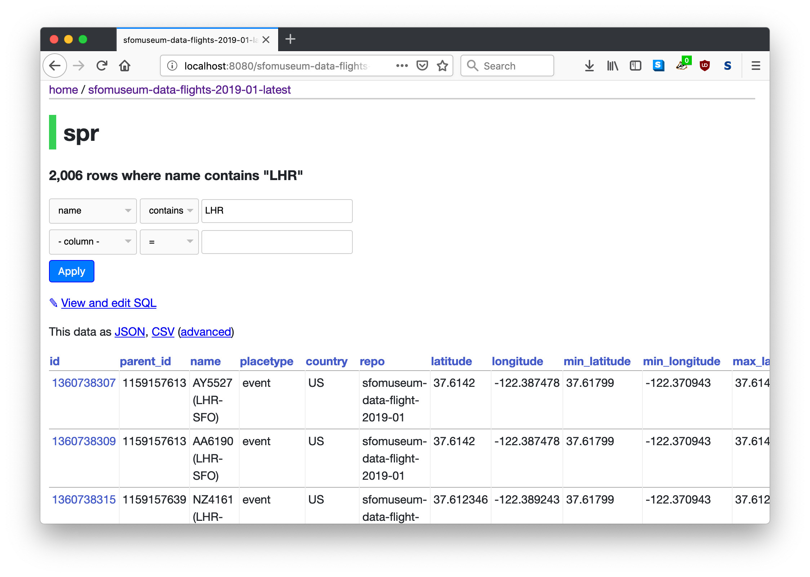

# sfomuseum-data-flights-datasette



Dockerfile for using SFO Museum flight data with `Datasette`.

## Set up

First of all you'll need to have `Docker` installed. If you don't already head over to [their website](https://www.docker.com/products/docker-desktop) to download the necessary tools.

Once you have you'll want to "build" the `sfomuseum-data-flights-datasette` Docker container, from the command line, like this:

```
$> docker build -t sfomuseum-data-flights .
```

To launch the container you would type:

```
$> docker run -it -p 8080:8001 sfomuseum-data-flights
```

And then to view the data, in the Datasette web application, open the following URL in your web browser:

```
http://localhost:8080
```

_You can change port `8080` to whatever you want but make sure you do it in both the `docker run` command and the URL you visit in your web browser._

## Notes

Currently this Dockerfile is hardcoded to fetch flight data for January, 2019 and February, 2019. It will be updated shortly to fetch all the available flight data.

## See also

### SFO Museum

* https://millsfield.sfomuseum.org/flights/
* https://millsfield.sfomuseum.org/blog/2019/01/18/flights/
* https://millsfield.sfomuseum.org/distributions/sqlite/
* https://github.com/sfomuseum-data/

### Datasette

* https://datasette.readthedocs.io/en/stable/
* https://github.com/simonw/datasette

### Docker

* https://www.docker.com